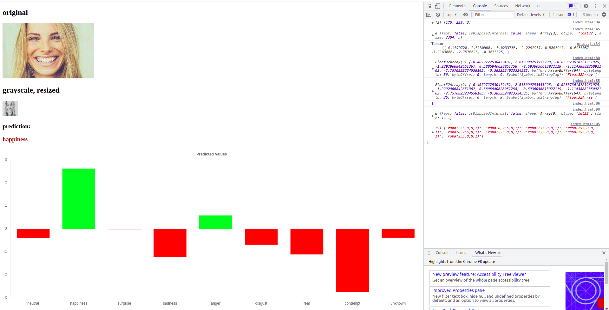
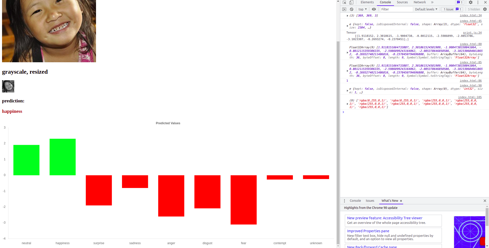
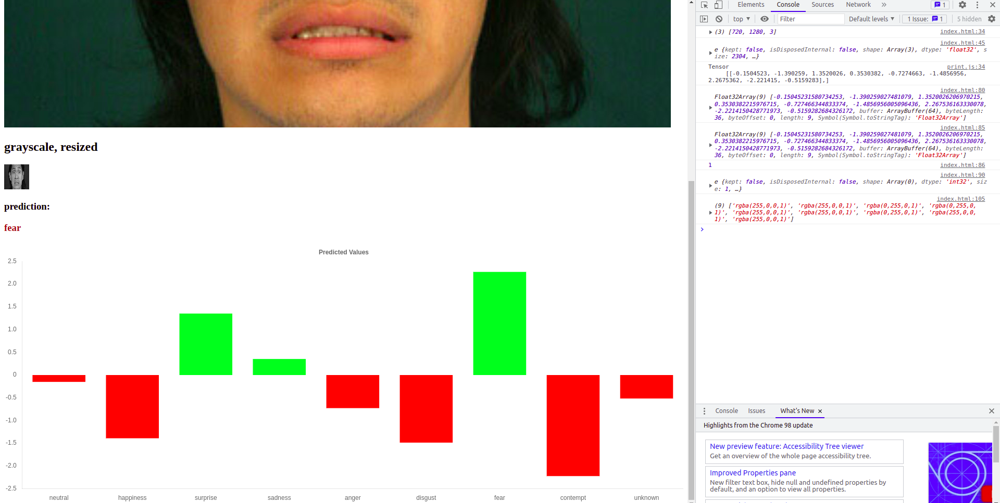
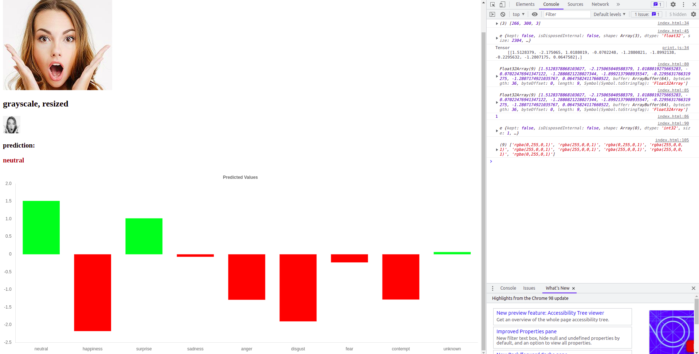
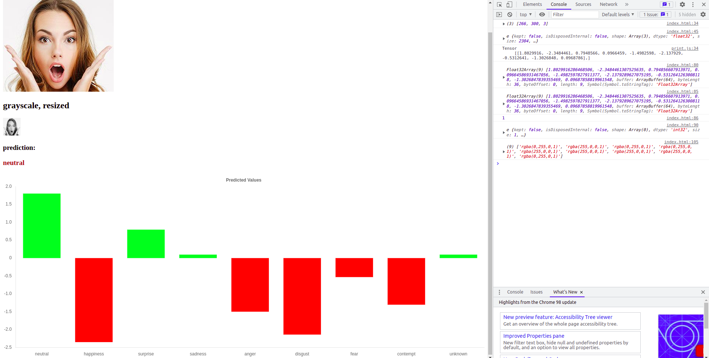

## screenshots

predictions made using the saved tensorflowjs model. note that the value of predictions are slightly different from when the model was run on pytorch.   
this could be because the weights were slightly affected when the model was converted from pytorch -> onnx -> tensorflow -> tensorflowjs. i tried the uncompressed version of the model too, but the results look identical to the compressed version (the tfjsmodel that is used here has a compression of 2x. relevant github link: [tfjs-converter](https://github.com/tensorflow/tfjs/tree/master/tfjs-converter)). the screenshots below show the results of the 2x compressed model.
  
on further reflection, i dont think the weights were changed. the image preprocessing/transformation might be the culprit. but after testing, both perform similarly, and below the pytorch level. check the surprise image in the examples below
  
  
  
  
  
above example uses resizeNearestNeighbor 
  
above example uses resizeBilinear 
since resizeNearestNeighbor is faster, we'll use that although resizeBilinear is the more advised. 